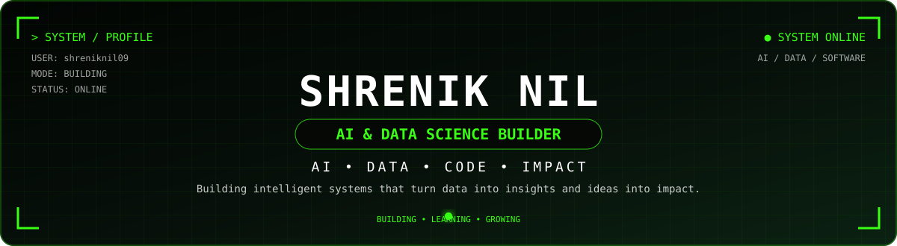

<div align="center">



<br/>

<a href="https://github.com/shreniknil09">GitHub</a>
&nbsp; • &nbsp;
<a href="https://linkedin.com/in/shrenik-nil-b30980285">LinkedIn</a>
&nbsp; • &nbsp;
<a href="./resume.pdf">Resume</a>
&nbsp; • &nbsp;
<a href="mailto:shreniknil.0902@gmail.com">Email</a>

<br/><br/>

`AI` &nbsp; `DATA` &nbsp; `CODE` &nbsp; `IMPACT`

</div>

---

## `01` // SYSTEM PROFILE

```text
┌──────────────────────────────────────────────────────────────┐
│                                                              │
│  USER        : SHRENIK NIL                                   │
│  ROLE        : AI & DATA SCIENCE BUILDER                     │
│  STATUS      : BUILDING • LEARNING • GROWING                 │
│                                                              │
│  FOCUS       : DATA SCIENCE                                  │
│              : MACHINE LEARNING                              │
│              : GENERATIVE AI                                 │
│              : SOFTWARE ENGINEERING                           │
│                                                              │
│  MISSION     : Turn problems → data → intelligence → impact  │
│                                                              │
└──────────────────────────────────────────────────────────────┘
```

I'm a Computer Science student focused on building practical systems across **Data Science, Machine Learning, Generative AI and Software Development**.

I prefer learning by building:

`PROBLEM → DATA → ANALYSIS → MODEL → APPLICATION`

My goal is to become a strong **Data Scientist / AI Engineer** capable of taking ideas from experimentation to usable intelligent systems.

---

## `02` // CURRENT OPERATING MODE

<div align="center">

| DOMAIN | MODE |
|:---|:---:|
| 🧠 Machine Learning | BUILD |
| 📊 Data Science | BUILD |
| ✨ Generative AI | LEARN + BUILD |
| ⚙️ Data Engineering | EXPLORE |
| 💻 Software Engineering | STRENGTHEN |

</div>

### `CURRENTLY LEARNING`

<div align="center">

**GENERATIVE AI**

`LLMs` · `Prompt Engineering` · `RAG` · `Embeddings` · `AI Applications`

</div>

---

## `03` // TECHNOLOGY STACK

### `LANGUAGES`

`Python` · `SQL`

### `DATA & ANALYTICS`

`NumPy` · `Pandas` · `Matplotlib` · `Seaborn` · `Plotly` · `Power BI`

### `MACHINE LEARNING`

`Scikit-learn` · `TensorFlow` · `PyTorch` · `Keras` · `XGBoost`

### `GENERATIVE AI`

`LLMs` · `RAG` · `Prompt Engineering` · `Embeddings` · `Vector Databases`

### `ENGINEERING`

`Git` · `GitHub` · `VS Code` · `Jupyter` · `APIs` · `DBMS`

---

## `04` // WHAT I BUILD

<table>
<tr>
<td width="50%">

### 🧠 MACHINE LEARNING

`EDA` · `Preprocessing` · `Feature Engineering`

`Regression` · `Classification` · `Evaluation`

</td>

<td width="50%">

### 📊 DATA SCIENCE

`Python` · `SQL` · `Statistics`

`Data Cleaning` · `Visualization` · `Insights`

</td>
</tr>

<tr>
<td width="50%">

### ✨ GENERATIVE AI

`LLMs` · `RAG` · `Embeddings`

`Prompt Engineering` · `AI Workflows`

</td>

<td width="50%">

### 💻 SOFTWARE

`DSA` · `OOP` · `DBMS`

`APIs` · `Git/GitHub` · `Backend Fundamentals`

</td>
</tr>
</table>

---

## `05` // FEATURED SYSTEMS

### `01` — 🔥 CricketGPT OS

**AI-powered intelligence platform**

`Python` `Machine Learning` `GenAI` `Data Engineering` `FastAPI`

An end-to-end system combining data, analytics, machine learning and generative AI.

→ **[Open Repository](https://github.com/shreniknil09/cricketgpt-os)**

---

### `02` — 🧠 Plant Disease Detection

**Computer vision / machine learning project**

`Python` `Jupyter` `Deep Learning`

A machine-learning project focused on identifying plant diseases from images.

→ **[Open Repository](https://github.com/shreniknil09/plant-disease-detection)**

---

### `03` — ✨ Team Vikings — Gemma GDG

**Generative AI / collaborative project**

A team project exploring practical applications around the Gemma ecosystem.

→ **[Open Repository](https://github.com/shreniknil09/Team-Vikings-Gemma-GDG)**

---

### `04` — 👥 Envision — Team Bandhilki

**Collaborative development project**

A team-based project built through collaborative problem solving and implementation.

→ **[Open Repository](https://github.com/shreniknil09/envision---Team-Bandhilki)**

---

<div align="center">

**[ EXPLORE ALL REPOSITORIES → ](https://github.com/shreniknil09?tab=repositories)**

</div>

---

## `06` // ENGINEERING LOOP

<div align="center">

```text
LEARN
  ↓
BUILD
  ↓
BREAK
  ↓
DEBUG
  ↓
UNDERSTAND
  ↓
IMPROVE
  ↓
SHIP
```

### `CONSISTENCY > INTENSITY`

</div>

---

## `07` // GITHUB INTELLIGENCE

<div align="center">

```text
┌──────────────────────────────────────────────────────────┐
│                    GITHUB / SIGNAL                       │
├──────────────────────────────────────────────────────────┤
│                                                          │
│   CODE        DATA        AI        SYSTEMS              │
│    │           │          │           │                 │
│    └───────────┴──────────┴───────────┘                 │
│                         ↓                                │
│                    BUILD → SHIP                           │
│                                                          │
└──────────────────────────────────────────────────────────┘
```

**Primary signal:** projects, commits, issues, pull requests and contribution activity.

This profile intentionally avoids fragile third-party statistic cards so the README remains clean and reliable.

</div>

---

## `08` // CONTRIBUTION MATRIX

<div align="center">


<br/>

`CONTRIBUTIONS → CONSISTENCY → GROWTH`

</div>

---

## `09` // BUILDING TOWARD

<div align="center">

```text
DATA
 ↓
INSIGHT
 ↓
MODEL
 ↓
INTELLIGENCE
 ↓
APPLICATION
 ↓
REAL-WORLD IMPACT
```

</div>

The long-term direction is to combine **Data Science + AI + Software Engineering** to build complete, useful systems.

---

## `10` // CONNECT

<div align="center">

### `BUILD • LEARN • CREATE • REPEAT`

Open to conversations around:

`AI` · `Data Science` · `Machine Learning` · `GenAI` · `Open Source` · `Interesting Problems`

<br/>

**[LinkedIn](https://linkedin.com/in/shrenik-nil-b30980285)**  
**[GitHub](https://github.com/shreniknil09)**  
**[Resume](./resume.pdf)**  
**[Email](mailto:shreniknil.0902@gmail.com)**

<br/><br/>

`SYSTEM STATUS: ONLINE`

</div>

---

<div align="center">


</div>
